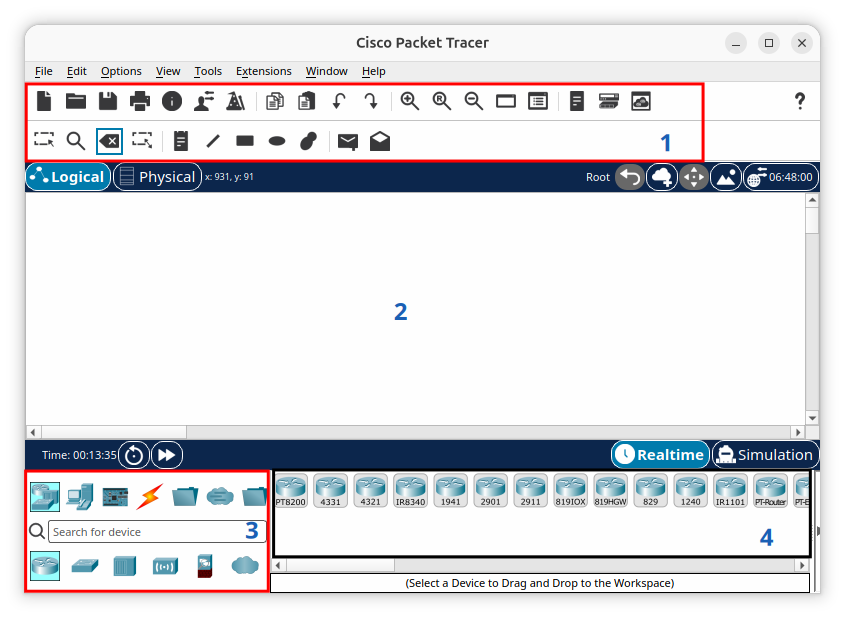
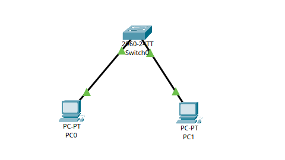
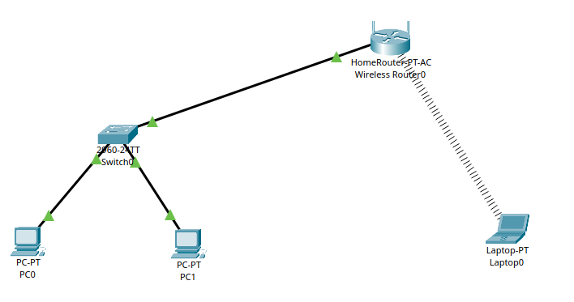
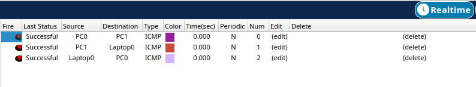

# Laboratorio 01

## Fundamentos de Redes y Modelos de Referencia (OSI y TCP/IP)

## Temas:
- Laboratorio Packet Tracer.
  - Construcción de topologías Peer-to-Peer y Cliente-Servidor. Simulación del proceso de encapsulamiento mediante la inspección visual de PDU en cada capa.
- Laboratorio GNU/Linux.
  - Inspección de interfaces de red mediante ip a, ifconfig, diagnóstico de conectividad básico con ping y trazado de rutas con traceroute / mtr.
- Programación Emisor-Receptor.
  - Construcción de un script emisor-receptor de Socket RAW para la captura e inspección visual de bytes en bruto sobre la interfaz de red local.

## Cisco Packet Tracer
- Herramienta de simulación para la configuración de redes.
- Puedes experimentar mientras construyes, administrar y asegurar infraestructuras.



- **Sección 1**: Barra de herramientas con la cual se puede crear un nuevo esquema, guardar una configuración, zoom, entre otras funciones.
- **Sección 2**: Área de trabajo, sobre la cual se realiza el dibujo del esquema topológico de la red.
- **Sección 3**: Grupo de elementos disponibles para la implementación de cualquier esquema topológico, el cual incluye: Routers, Switches, Cables para conexión, dispositivos terminales (PCs, impresoras, Servidores), Dispositivos Inalámbricos, entre otros.
- **Sección 4**: Conjunto de elementos que hacen parte del dispositivo seleccionado en la sección 3. A continuación se ilustran el conjunto de elementos que hacen parte de cada grupo de dispositivos.
  - Routers: Series 1800, 2600, 2800, Genéricos.
  - Switches: Series 2950,2960, Genérico, Bridge.
  - Dispositivos Inalámbricos: Access-Point, Router Inalámbrico.
  - Tipos de conexiones disponibles: Cable Serial, consola, directo, cruzado, fibra óptica, teléfono, entre otras.
  - Dispositivos terminales: PC, Servidores, Impresoras, Teléfonos IP.
  - Dispositivos Adicionales: PC con tarjeta inalámbrica.

## LAN (Red de Area Local)



- **Paso 1: Crear tu primera red básica**
  - Selecciona dos PC desde el menú inferior y arrastralas al espacio central.
  - Elige un Switch (por ejemplo, el modelo 2960) y colócalo entre las dos computadoras.
  - Ve al icono de un rayo (conexiones) y selecciona el Cable Copper Straight-Through (directo).
  - Haz clic en la PC0, elige "FastEthernet0" y conecta el otro extremo al Switch en "FastEthernet0/1".
  - Repite el proceso conectando la PC1 al puerto "FastEthernet0/2" del Switch.
- **Paso 2: Configurar las direcciones IP**
  - Haz clic sobre la PC0, ve a la pestaña Desktop y selecciona IP Configuration.
  - Elige Static y escribe una dirección IP (por ejemplo, 192.168.1.10) y una máscara de subred (255.255.255.0).
  - Cierra esa ventana, abre la PC1, ve a IP Configuration y asígnale otra IP de la misma red (por ejemplo, 192.168.1.11) con la misma máscara (255.255.255.0).
- **Paso 3: Probar la conexión con Ping**
  - Haz clic en la PC0, entra a Desktop y abre el Command Prompt (consola de comandos).
  - Escribe ping 192.168.1.11 (la IP de la otra computadora) y presiona Enter.
  - Si ves respuestas que dicen "Reply from...", significa que tu red funciona de manera correcta.
 
## WIFI (Comunicación inalámbrica IEEE 802.11)



- **Paso 4: Agregar los nuevos equipos al espacio de trabajo**
  - Ve a la esquina inferior izquierda, haz clic en Network Devices, luego entra en la subcategoría Wireless Devices.
  - Selecciona el dispositivo llamado Home Gateway (el router inalámbrico residencial común) y arrástralo a tu pantalla.
  - Ahora cambia a la categoría End Devices y arrastra una Laptop al espacio de trabajo.
- **Paso 5: Conectar el Router Wi-Fi al Switch (Cableado)**
  - Para que los dispositivos inalámbricos tengan acceso a las PCs que ya tenías, el router debe estar unido al switch central.
  - Selecciona la herramienta de Connections (icono del Rayo) y elige el cable negro continuo (Copper Straight-Through).
  - Haz clic en el Switch0 y conéctalo en cualquier puerto disponible (por ejemplo, FastEthernet0/3).
  - Lleva el cable hacia el Home Gateway y conéctalo estrictamente en el puerto Ethernet 1 (no lo conectes en el puerto Internet, ya que ese se usa para módems externos).
- **Paso 6: Modificar la Laptop para que use Wi-Fi (¡Muy Importante!)**
  - En Packet Tracer, las laptops vienen de fábrica únicamente con una tarjeta de red para cable (Ethernet). Debes cambiarla físicamente por una tarjeta inalámbrica.
  - Haz clic sobre la Laptop para abrir su ventana de configuración.
  - Asegúrate de estar en la pestaña Physical (Física).
  - Verás una imagen del lateral de la laptop. Busca el botón de encendido (un pequeño interruptor con una luz verde) y haz clic en él para apagar la laptop (la luz verde se apagará).
  - En el dibujo de la laptop, arrastra el puerto actual (el conector Ethernet que está abajo a la derecha) hacia la lista de módulos de la izquierda para quitarlo. El espacio quedará vacío.
  - En la lista de módulos de la izquierda, selecciona el primero llamado WPC300N (es la tarjeta Wi-Fi de 2.4GHz).
  - Arrastra ese módulo WPC300N hacia el hueco vacío en el dibujo de la laptop.
  - Vuelve a hacer clic en el botón de encendido para prender la laptop.
  - Nota: Al encenderla, verás que aparece automáticamente una línea discontinua que une la Laptop con el Home Gateway. Esto significa que ya se asociaron por Wi-Fi de forma abierta.
- **Paso 7: Ajustar el direccionamiento IP de la Laptop**
  - Para que toda la red se comunique en el mismo segmento que tus PCs anteriores (192.168.1.X), haremos lo siguiente:
  - Haz clic en el Home Gateway, ve a la pestaña Config y en el menú izquierdo selecciona LAN.
  - Verifica que su IP esté en el mismo rango. Por defecto suele venir como 192.168.0.1. Cambia ese valor a 192.168.1.1 para que no choque con tus PCs y pertenezca a la misma red. La máscara se pondrá sola en 255.255.255.0.
  - Haz clic en la Laptop, entra a la pestaña Desktop -> IP Configuration.
  - Selecciona la opción DHCP. El Home Gateway le asignará automáticamente una dirección IP libre dentro del rango correcto (por ejemplo, 192.168.1.100).
- **Paso 8: Prueba de fuego (Validación)**
  - Para asegurarte de que todo funciona a la perfección, haremos un ping desde la nueva Laptop hacia una de tus PCs fijas:
  - En la Laptop, ve a Desktop y abre el Command Prompt (Consola).
  - Escribe ping 192.168.1.10 (la IP de la PC0) y presiona Enter.
  - Si los paquetes son recibidos con éxito, tu red híbrida (cableada e inalámbrica) está completamente operativa.
 
## Envío de una Simple PDU en Packet Tracer



- En redes de datos, PDU significa Protocol Data Unit (Unidad de Datos del Protocolo). Es el término técnico que se utiliza para referirse a un bloque de información que viaja por la red en una capa específica del modelo OSI.
- Dependiendo de la capa donde se encuentre, la PDU cambia de nombre:
  - En la capa de Aplicación, la PDU son los Datos puros.
  - En la capa de Transporte, la PDU se llama Segmento (TCP) o Datagrama (UDP).En la capa de Red, la PDU se llama Paquete (donde viajan las direcciones IP).
  - En la capa de Enlace de Datos, la PDU se llama Trama o Frame (donde viajan las direcciones MAC).
- En Cisco Packet Tracer, cuando usas la herramienta de "Simple PDU" (el icono del sobre cerrado), estás simulando el envío de un paquete Ping (ICMP) de una máquina a otra para verificar si hay comunicación rápida.

- **Paso 9: Selecciona la herramienta PDU**
  -Ve a la barra de herramientas del lado derecho (o superior, según tu versión de Packet Tracer).
  - Busca el icono de un sobre cerrado. Al pasar el mouse por encima, dirá Add Simple PDU (o puedes presionar el atajo de teclado letra P). Tu cursor del mouse se transformará en el icono de un sobre.
- **Paso 10: Marca el Origen y el Destino**
  - Haz un clic sobre la Laptop o la PC desde donde quieres que salga el mensaje (Origen).
  - Mueve el mouse (verás que el sobre sigue pegado al cursor) y haz un segundo clic sobre el dispositivo que deseas recibir el mensaje, por ejemplo, la PC0 (Destino).
- **Paso 11: Revisa el resultado instantáneo (Modo Realtime)**
  - Mira la esquina inferior derecha de la pantalla. Verás un panel expandible llamado Simulation Panel / PDU List.
  - Si la barra está oculta, haz clic en la pequeña flecha del extremo inferior derecho para desplegarla.
  - Allí aparecerá una línea con los detalles del envío. Si todo está bien configurado, en la columna Last Status verás un texto en color verde que dice Successful (Exitoso). Si hay un error de IPs o cables, dirá Failed (Fallido).
- Paso 12: Ver el viaje en cámara lenta (Modo Simulation)**
  - Para ver el recorrido exacto que hace el sobre a través del Router Wi-Fi y el Switch:
  - Haz clic en la pestaña Simulation (justo detrás del botón Realtime en la esquina inferior derecha). Se abrirá el panel de simulación.
  - Verás el sobre físicamente posicionado encima de tu dispositivo de origen.
  - Haz clic en el botón de Play (Capture / Forward, que tiene un icono de una flecha hacia la derecha con una barra vertical).
  - Cada vez que hagas clic, verás cómo el sobre avanza de un equipo a otro. El proceso completo simula la ida (petición) y la vuelta (respuesta) del paquete. Al finalizar con éxito, el sobre mostrará una pequeña marca de verificación verde.

## Inspección de Interfaces de Red

- Estas herramientas permiten verificar qué tarjetas de red (físicas o virtuales) están activas, sus direcciones IP, máscaras de subred y direcciones MAC.
  
- **Comando ip a (o ip address)**
  - Es la herramienta moderna y estándar en todas las distribuciones Linux actuales (paquete iproute2).
    ```bash
    ip a
    ```
  - **lo**: Interfaz de loopback (local, siempre 127.0.0.1).
  - **eth0, enp3s0, wlan0**: Nombres de las interfaces físicas (Ethernet o Wi-Fi).
  - **inet**: Muestra la dirección IPv4 asignada y su máscara en formato CIDR (ej. 192.168.1.15/24).
  - **link/ether**: Muestra la dirección MAC física del dispositivo.
  - **UP**: Indica que la interfaz está encendida y operativa.

- **Comando ifconfig**
  - Es la herramienta tradicional. Aunque está obsoleta (deprecated) y ha sido reemplazada por ip, todavía se encuentra en muchos sistemas antiguos o servidores estables (paquete net-tools).
  ```bash
  ifconfig
  ```
  - **inet**: Dirección IPv4.
  - **netmask**: Máscara de subred tradicional (ej. 255.255.255.0).
  - **ether**: Dirección MAC.
  - **RX packets / TX packets**: Estadísticas de paquetes recibidos y transmitidos (útil para detectar errores o pérdida de paquetes a nivel de hardware).
 
## Diagnóstico de Conectividad Básico

- Una vez verificada la interfaz local, el siguiente paso es comprobar si el equipo puede comunicarse con otros nodos de la red.
- **Comando ping**
  - Envía paquetes de solicitud de eco (ICMP Echo Request) a un destino para verificar si está encendido y accesible.
  ```bash
  ping 8.8.8.8
  ```
  ```bash
  ping -c 4 google.com
  ```
  - **time=XX ms**: El tiempo de ida y vuelta (Round Trip Time o RTT). Valores bajos indican una conexión rápida.
  - **packet loss**: El porcentaje de paquetes perdidos. Lo ideal es 0%. Si es mayor, hay problemas de saturación, interferencia o fallas en el cableado.
 
## Trazado de Rutas
- Cuando el comando ping falla o la conexión es lenta, el trazado de rutas ayuda a identificar exactamente en qué punto o salto (hop) de la red pública o privada se está interrumpiendo o ralentizando el tráfico.
  
  - **Comando traceroute**
  - Muestra la ruta exacta que toman los paquetes desde tu equipo hasta el destino, listando cada uno de los routers (saltos) por los que pasa.
   ```bash
  traceroute google.com
  ```
  - **Cómo funciona**: Incrementa el tiempo de vida (TTL) del paquete de 1 en 1. Cada router en el camino descarta el paquete cuando el TTL llega a cero y devuelve un mensaje de error ICMP, revelando su identidad.
  - **Qué buscar**: Si ves asteriscos (* * *), significa que ese router intermedio tiene bloqueados los paquetes de diagnóstico por motivos de seguridad o que la red se cayó en ese punto exacto.
 
## Comando mtr (My Traceroute)
- Es una herramienta avanzada que combina la funcionalidad de ping y traceroute en una interfaz interactiva y en tiempo real.
  ```bash
  mtr google.com
  ```
- **Ventajas**: No realiza una sola pasada como traceroute, sino que sigue enviando paquetes continuamente a cada salto.
- **Loss%**: Permite ver con precisión matemática qué router intermedio del proveedor de internet está perdiendo paquetes.
- **Last/Avg/Best/Wrst**: Estadísticas de latencia (última, promedio, mejor y peor) por cada salto, ideal para detectar picos de lag intermitentes.

## Crear dos nodos Emisor-Receptor con Docker

- Se puede utilizar Docker para crear dos contenedores que estén conectados en una misma red y tengan los paquetes necesarios para realizar pruebas de comunicación y envío de paquetes.
- **Dockerfile**
  - Este archivo crea la imagen rcd_lab01_image_escobedo con OpenJDK 17, Vim, ip, ifconfig, ping, traceroute y mtr.
```bash
FROM eclipse-temurin:17-jdk

RUN apt-get update && \
    apt-get install -y \
        vim \
        iproute2 \
        net-tools \
        iputils-ping \
        traceroute \
        mtr-tiny \
    && rm -rf /var/lib/apt/lists/*

CMD ["tail", "-f", "/dev/null"]
```
- **docker-compose.yml**
```bash
services:

  container1:
    build:
      context: .
      dockerfile: Dockerfile
    image: rcd_lab01_image_escobedo
    container_name: rcd_lab01_container1_escobedo
    hostname: container1
    networks:
      - rcd_lab01_network_escobedo
    stdin_open: true
    tty: true
    restart: unless-stopped

  container2:
    build:
      context: .
      dockerfile: Dockerfile
    image: rcd_lab01_image_escobedo
    container_name: rcd_lab01_container2_escobedo
    hostname: container2
    networks:
      - rcd_lab01_network_escobedo
    stdin_open: true
    tty: true
    restart: unless-stopped

networks:
  rcd_lab01_network_escobedo:
    name: rcd_lab01_network_escobedo
    driver: bridge
```
- **Construir la imagen y crear los contenedores**
- Desde la carpeta donde están Dockerfile y docker-compose.yml:
```bash
docker compose up -d --build
```
```bash
docker ps
```
```bash
docker exec -it rcd_lab01_container1_escobedo bash
```
- Si quieres eliminar los contenedores y la red creada por Compose:
```bash
docker compose down
```

## Actividades
Trabajar preferentemente en grupos de 2 estudiantes.
Elaborar un informe detallado, paso a paso, que explique e incluya capturas de pantalla.
1. Crear una LAN con 3 computadoras de escritorio conectadas a un switch por cable. A su vez, existe un router que brinda la pasarela al switch por cable y a otros 2 equipos inalámbricamente (laptops).
2. Crear dos contenedores en Docker de acuerdo con la nomenclatura utilizada para realizar la inspección de las interfaces de red, el diagnóstico de conectividad y el trazado de rutas. 

## Referencias 
- [Cisco Networking Academy - Recursos de aprendizaje - Cisco Packet Tracer
](https://www.netacad.com/resources/lab-downloads?courseLang=es-XL)
- [Cisco Packet Tracer](https://www.netacad.com/es/cisco-packet-tracer)
- [Guía de Docker para principiantes: cómo crear tu primera aplicación Docker](https://www.freecodecamp.org/espanol/news/guia-de-docker-para-principiantes-como-crear-tu-primera-aplicacion-docker/)
- [Capítulo 1. Primeros pasos con Docker](https://recetas-docker.readthedocs.io/es/latest/capitulo_1.html)
- [ifconfig(8) - Linux man page](https://linux.die.net/man/8/ifconfig)
- [ping(8) - Linux man page](https://linux.die.net/man/8/ping)
- [traceroute(8) - Linux man page](https://linux.die.net/man/8/traceroute)
- 

