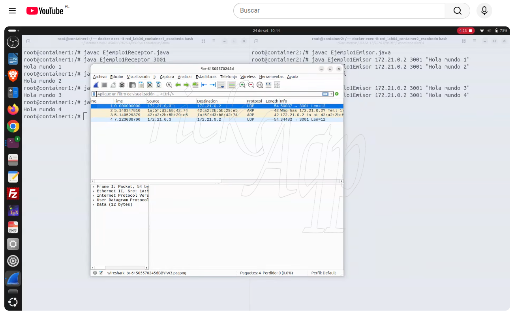

# Laboratorio 04

## Tema: Analizar paquetes con Wireshark

## Wireshark:
- Es un analizador de paquetes de red gratuito y de código abierto que permite capturar e inspeccionar en tiempo real el tráfico que circula por una red de comunicaciones.
- Descargar Wireshark: https://www.wireshark.org/#download
- Vea el video para instalar Wireshark en GNU/Linux:
- [](https://www.youtube.com/watch?v=opVVhChYFyg)

## Cree hosts para probar sus comunicaciones:
- Opción A: Utilizar el sistema operativo en 2 o más computadoras de laboratorio (se utilizará la red LAN del laboratorio).
- Opción B: Utilizar wsl en el sistema operativo de la computadora de laboratorio (se utilizará la red LAN del laboratorio).
- Opción C: Utilizar Docker para crear 2 o más contenedores en una computadora de laboratorio (se puede crear una red interna en Docker o utilizar la red LAN de laboratorio).
- Opción D: Utilizar Virtualbox para aplicar las opciones A, B o C.

## Grupos de 4 integrantes: (Indicar las tareas que realizó cada integrante)
| Alumno | Tarea realizada | Porcentaje |
|---|---|---|
|Apellidos y Nombres de Integrante 1|Descripción de la tarea.|100%|
|Apellidos y Nombres de Integrante 2|Descripción de la tarea.|100%|
|Apellidos y Nombres de Integrante 3|Descripción de la tarea.|100%|
|Apellidos y Nombres de Integrante 4|Descripción de la tarea.|100%|

## Actividades previas:
- **Construir la imagen y crear los contenedores**
- Desde la carpeta donde están Dockerfile y docker-compose.yml:
```bash
docker compose up -d --build
```
```bash
docker ps
```
```bash
docker exec -it rcd_lab04_container1_escobedo bash
```
```bash
docker exec -it rcd_lab04_container2_escobedo bash
```
- Si quieres eliminar los contenedores y la red creada por Compose:
```bash
docker compose down
```

## Tarea: Actividades a Desarrollar en Laboratorio
1. Formar grupos de hasta 4 integrantes.
2. Avisar al profesor cual será el respositorio a clonar faltando 10 minutos para culminar la clase.
3. Crear host utilizando cualquiera de la opciones A, B, C o D.
4. Capturar paquetes de las comunicaciones:
   - Comunicación simplex.
   - Comunicación dúplex o bidirencional.
   - Comunicación orientada a conexión.
5. Capturar pantallas y redactar un informe en el README.md del alumno responsable del grupo. 

## Capturando paquetes con WireShark
- [](https://www.youtube.com/watch?v=RsJKO8OwwuE)

## Comandos individuales para eliminar todos los artefactos de este laboratorio

```bash
docker ps
```

```bash
docker stop rcd_lab04_container1_escobedo
```

```bash
docker stop rcd_lab04_container2_escobedo
```

```bash
docker ps -a
```

```bash
docker rm rcd_lab04_container1_escobedo
```

```bash
docker rm rcd_lab04_container2_escobedo
```

```bash
docker images
```

```bash
docker rmi rcd_lab04_image_escobedo:latest
```

```bash
docker network ls
```

```bash
docker network rm rcd_lab04_network_escobedo
```

# Referencias
- [Cap 4. El API de Sockets. Pag. 98-106 ]((https://drive.google.com/file/d/1IWbPqprv7DjRywDDr67QuPHK1Y4LZIbX/view?usp=sharing))
